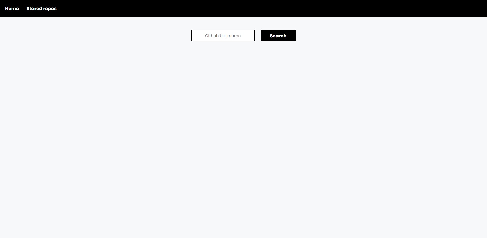
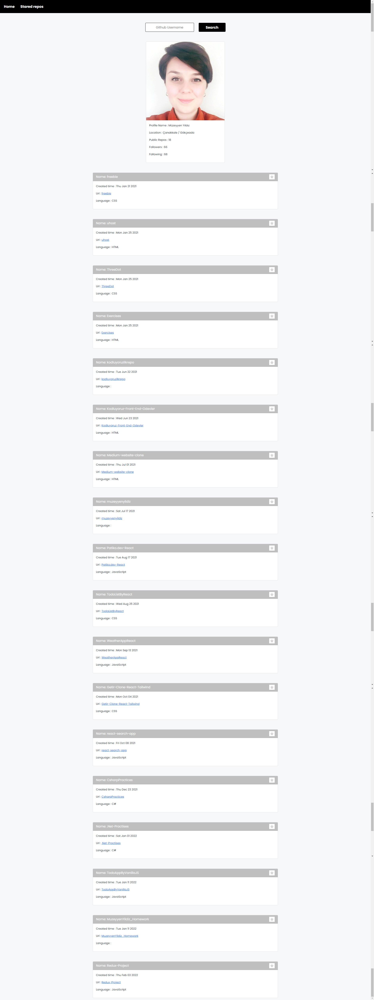
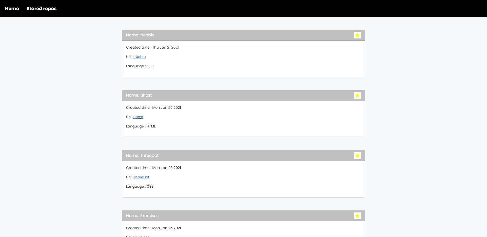

#### Requirements

**1.**  Listing the profile information and github repositories of the Github user whose name is entered

**2.**  The following information is expected to be displayed in the user information section.

- Name
- Location
- Company
- Avatar_url
- Public_repos
- Followers
- Following

**3.** Sorting and listing Github user's public repository by 'created_at' value

**4.** The following information is expected to be displayed in the repository information section.

- Repository name
- Repository creation time
- Repository url
- Repository language
- Favorite button


#### Features
- React.js
- React Hooks
- Redux
- Redux- toolkit
- React Bootstrap
- Fetch
- React router dom 
- Font-awesome
- Goggle-font


#### API

###### Github API get user information 

GET: 

```sh
https://api.github.com/users/{githubUserName}
```

<br/>

###### Github API get user repositories

GET: 

```sh
https://api.github.com/users/{githubUserName}/repos
```

#### Home Page


#### Searching Username and Displaying User Information and Repositories


#### Stared Repositories Page


Thanks for reading!


